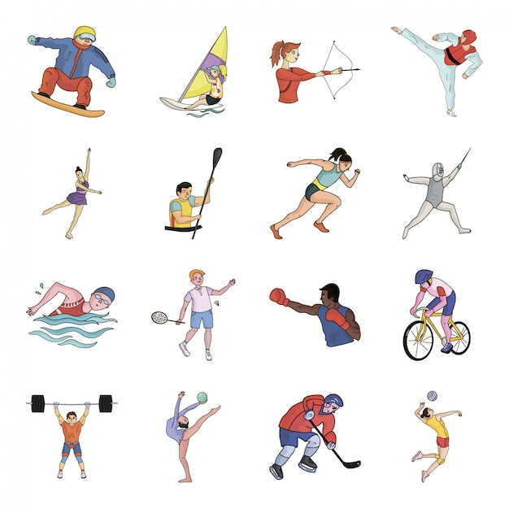

<h1 align="center"> 🏊🏼‍♂️🚴🏼‍♀️🏋🏼‍♂️ Olympics Data Analysis 🥇🥈🥉</h1>
  <div align="center">
</div>

<div align="center">
  
</div>


# 📜 Introduction

This dataset is a list of all the medal winners in the Summer Olympics from 1976 Montreal to 2008 Beijing. It includes each and every medal awarded within the period. For a project based on Olympics data analysis, the primary focus will be on exploring and understanding the dataset, performing exploratory data analysis (EDA), and uncovering trends and insights related to athletes, countries, and sports over the years.

We'll use the following columns for our analysis:
 
- **City** : *The city where the Olympics took place.*
- **Year** : *The year of the Olympics.*
- **Sport** : *The sport the event is categorized under.*
- **Discipline** : *A subcategory of the sport.*
- **Event** : *The specific event within a discipline.*
- **Athlete** : *The name of the athlete who participated.*
- **Gender** : *The gender of the athlete.*
- **Country_Code** : *The country code (abbreviation).*
- **Country** : *The full name of the country.*
- **Event_gender** : *The gender category of the event.*
- **Medal** : *The medal won (Gold, Silver, Bronze).*

# 🗂 Dataset
Here we can access the dataset used in the project.  
[Dataset](Summer-Olympic-medals-1976-to-2008.csv)
### After removing nulls and duplicates :
#### Number of Rows: 15315
#### Number of Columns: 11

# 📄 Objective

The primary goal is to:

1. Analyze the dataset to understand trends in medal distribution.
2. Identify the top-performing countries and athletes.
3. Study the gender distribution of events and medals.

- **Steps:**

(i) Data Preparation:
  - *Import libraries.*
  - *Load the dataset.*
  - *Clean the dataset (handling missing values, if any).*
  
(ii) Exploratory Data Analysis (EDA):
  - *Summary statistics of the dataset.*
  - *Plot and analyze trends of medals across years.*
  - *Identify the top-performing athletes and countries.*

(iii) Visualizing Key Insights:
  - *Visualize the distribution of medals by country, year, and sport.*
  - *Analyze gender distribution in different sports/events.*

# 🛠 Technology Stack

### 🐍 Python | 📊 Power BI

# 📚 Python Libraries
- **Pandas** - Data manipulation
- **NumPy** - Statistical analysis
- **Matplotlib & Seaborn** - Data visualization

# 📊 Power BI
- For visualization and dashboard creation.

### 📦 Install Required Libraries
Run the following command to install dependencies:
```bash
pip install pandas numpy
```
